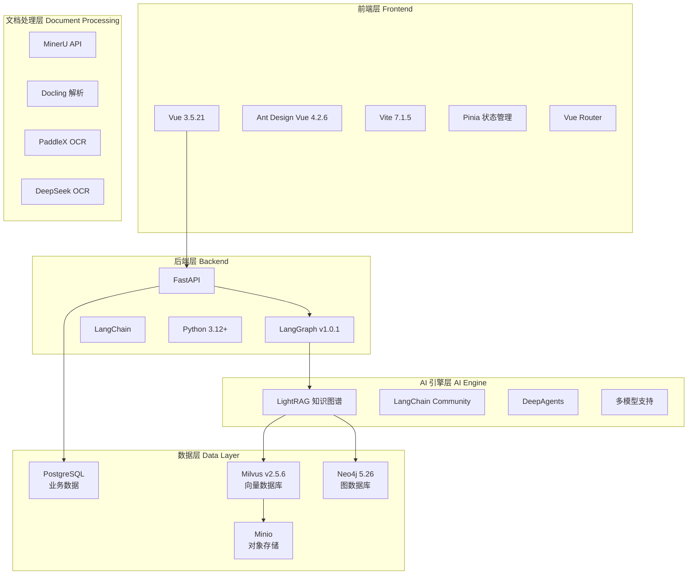
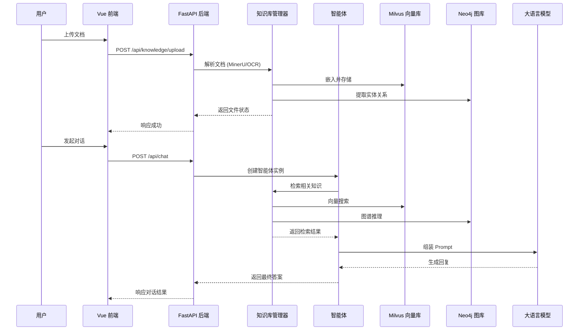

## 项目概述

根据我对代码库的深入分析，这是一个名为 **"语析" (Yuxi-Know)** 的专业级 **智能知识库与知识图谱智能体开发平台**。该项目采用现代化微服务架构，融合了 RAG (检索增强生成) 技术与知识图谱技术，为企业和开发者提供了一套完整的企业级 AI 应用开发解决方案。

---

## 📋 项目基本信息

| 项目属性 | 详情 |
|---------|------|
| **项目名称** | 语析 (Yuxi-Know) |
| **当前版本** | v0.5.0.dev |
| **开源协议** | MIT License |
| **开发语言** | Python 3.12+ / JavaScript (Vue 3) |
| **部署方式** | Docker Compose |
| **文档地址** | https://xerrors.github.io/Yuxi-Know/ |

---

## 🏗️ 技术架构

### 核心技术栈



### 关键依赖

#### 后端核心依赖
- **LangGraph** `>=1.0.1`: 智能体编排框架
- **LightRAG** `>=1.4.6`: 知识图谱构建与检索
- **FastAPI** `>=0.121`: 高性能异步 Web 框架
- **SQLAlchemy** `>=2.0.0`: ORM 框架
- **PyMilvus** `>=2.5.8`: Milvus 向量数据库客户端
- **Neo4j** `>=5.28.1`: 图数据库客户端
- **OpenAI SDK** `>=1.109`: 统一的 LLM 接口
- **DashScope** `>=1.23.2`: 阿里云模型支持

#### 前端核心依赖
- **Vue** `^3.5.21`: 前端框架
- **Ant Design Vue** `^4.2.6`: UI 组件库
- **Pinia** `^3.0.3`: 状态管理
- **@antv/g6** `^5.0.49`: 图可视化
- **ECharts** `^6.0.0`: 数据可视化
- **Lucide Vue** `^0.542.0`: 图标库

---

## 🎯 核心功能特性

### 1. 智能体开发平台
基于 **LangGraph v1** 的多智能体架构系统，支持：

- **多智能体编排**: 支持主智能体和子智能体的层级架构
- **工具调用系统**: 集成多种工具，包括知识库检索、数据库查询、网络搜索等
- **中间件机制**: 文件上传中间件、多模态支持、内容审查等
- **DeepAgents 深度分析智能体**: 支持 Todo、Files 等多种渲染方式
- **Human-in-the-Loop**: 支持人机交互式对话

### 2. 知识库系统 (RAG)
企业级知识库解决方案，提供：

- **多格式文档支持**: PDF、Word、Markdown、图片、文件夹/压缩包
- **向量检索**: 基于 Milvus 的高性能向量搜索
- **重排序**: 支持多种 Rerank 模型优化检索质量
- **知识库评估**: 支持导入评估基准或自动构建评估基准
- **文件管理**: 同名文件处理、批量上传、文件下载
- **智能检索模式**: Agentic Mode - 根据 file pattern 精准检索

### 3. 知识图谱系统
基于 **LightRAG** 的图数据库解决方案：

- **自动图谱构建**: 从文档自动提取实体和关系
- **图谱可视化**: 基于 G6 的专业图可视化
- **属性图谱支持**: 支持带属性的图谱文件上传
- **多模式检索**: content/graph/both 三种检索模式
- **图谱推理**: 参与智能体推理过程，提供结构化知识

### 4. 文档处理系统
强大的多模态文档解析能力：

- **MinerU**: 最新的 PDF 解析引擎 (支持 2.6+ 版本)
- **Docling**: Office 文件解析
- **OCR 引擎**: PaddleX OCR、DeepSeek OCR、RapidOCR
- **图片支持**: MinerU Official、Docs、Markdown Zip 格式
- **思维导图生成**: 基于知识库文件自动生成思维导图
- **示例问题生成**: 智能生成知识库相关问题

### 5. MCP (Model Context Protocol) 支持
- **数据库驱动的 MCP 配置**: 动态管理 MCP 工具
- **与知识库解耦**: 在 context 层面完成工具与知识库的解耦

---

## 📁 项目结构详解

```
/workspace
├── server/                    # FastAPI 后端服务
│   ├── main.py               # 应用入口，包含中间件配置
│   ├── routers/              # API 路由模块
│   │   ├── auth_router.py    # 认证相关
│   │   ├── chat_router.py    # 对话相关
│   │   ├── knowledge_router.py  # 知识库相关
│   │   ├── graph_router.py   # 图谱相关
│   │   ├── agent_router.py   # 智能体相关
│   │   └── ...
│   └── utils/                # 工具模块
│       ├── auth_middleware.py   # 认证中间件
│       ├── access_log_middleware.py  # 访问日志
│       └── lifespan.py       # 生命周期管理
│
├── src/                       # 核心业务逻辑
│   ├── config/               # 配置管理
│   │   └── app.py           # 应用配置类 (支持热更新)
│   ├── agents/               # 智能体模块
│   │   ├── __init__.py      # AgentManager 自动发现机制
│   │   ├── common/          # 基础智能体类
│   │   ├── chatbot/         # 聊天机器人
│   │   ├── deep_agent/      # 深度分析智能体
│   │   └── reporter/        # 报告生成智能体
│   ├── knowledge/            # 知识库模块
│   │   ├── base.py          # 抽象基类
│   │   ├── manager.py       # 知识库管理器
│   │   ├── indexing.py      # 索引处理
│   │   └── factory.py       # 工厂模式
│   ├── plugins/              # 文档处理插件
│   │   ├── mineru_parser.py    # MinerU 解析
│   │   ├── paddlex_parser.py    # PaddleX OCR
│   │   ├── deepseek_ocr_parser.py  # DeepSeek OCR
│   │   └── ...
│   ├── models/               # 数据模型
│   ├── repositories/         # 数据访问层
│   └── utils/                # 工具函数
│
├── web/                       # Vue 前端
│   ├── src/
│   │   ├── views/           # 页面视图
│   │   │   ├── AgentView.vue      # 智能体管理
│   │   │   ├── DataBaseView.vue   # 知识库管理
│   │   │   ├── GraphView.vue      # 图谱可视化
│   │   │   ├── DashboardView.vue  # 仪表盘
│   │   │   └── ...
│   │   ├── apis/            # API 接口定义
│   │   ├── components/      # 公共组件
│   │   ├── stores/          # Pinia 状态管理
│   │   └── assets/          # 静态资源
│   ├── package.json
│   └── vite.config.js
│
├── docker/                    # Docker 配置
│   ├── api.Dockerfile
│   ├── web.Dockerfile
│   ├── mineru.Dockerfile
│   └── paddlex.Dockerfile
│
├── scripts/                   # 工具脚本
│   ├── init.sh              # 初始化脚本
│   ├── migrate_*.py         # 数据迁移脚本
│   └── batch_upload.py      # 批量上传工具
│
├── test/                      # 测试用例
│   ├── api/                 # API 测试
│   └── conftest.py          # pytest 配置
│
├── docs/                      # 项目文档
│   ├── .vitepress/          # VitePress 配置
│   ├── latest/              # 最新版本文档
│   └── vibe/                # 开发者文档
│
├── docker-compose.yml        # 开发环境配置
├── docker-compose.prod.yml   # 生产环境配置
├── pyproject.toml           # Python 项目配置
├── Makefile                 # 构建脚本
└── .env                     # 环境变量
```

---

## 🔧 开发工作流

### 快速启动

```bash
# 1. 克隆项目
git clone --branch v0.4.4 --depth 1 https://github.com/xerrors/Yuxi-Know.git
cd Yuxi-Know

# 2. 初始化环境
./scripts/init.sh  # Linux/macOS
# 或
.\scripts\init.ps1  # Windows PowerShell

# 3. 启动服务
docker compose up --build

# 4. 访问应用
# 前端: http://localhost:5173
# 后端: http://localhost:5050
# Neo4j: http://localhost:7474
# MinIO: http://localhost:9001
```

### 开发规范

#### 后端开发
- **代码风格**: 符合 Pythonic 风格，使用 Ruff 进行代码检查
- **API 路由**: 所有 API 定义在 `server/routers/` 下
- **版本兼容**: 支持 Python 3.12+
- **测试**: 使用 pytest，测试文件放在 `test/` 目录

```bash
# 代码检查和格式化
make lint          # 检查代码规范
make format        # 格式化代码

# 运行测试
make router-tests  # 运行 API 测试

# 在容器内执行命令
docker compose exec api uv run python test/your_script.py
```

#### 前端开发
- **API 接口**: 所有接口定义在 `web/src/apis/` 下
- **图标库**: 优先使用 `lucide-vue-next`，尺寸需注意
- **样式**: 使用 Less，遵循 `base.css` 中的颜色变量
- **UI 风格**: 简洁一致，避免悬停位移、过度阴影和渐变色

```bash
cd web
pnpm run dev      # 开发模式
pnpm run build    # 生产构建
pnpm run lint     # 代码检查
pnpm run format   # 代码格式化
```

### Docker 服务架构

项目通过 Docker Compose 管理以下服务：

| 服务名 | 容器名 | 端口 | 说明 |
|--------|--------|------|------|
| **api** | api-dev | 5050 | FastAPI 后端服务 |
| **web** | web-dev | 5173 | Vue 前端服务 |
| **postgres** | postgres | 5432 | PostgreSQL 数据库 |
| **milvus** | milvus | 19530, 9091 | 向量数据库 |
| **neo4j** | graph | 7474, 7687 | 图数据库 |
| **minio** | milvus-minio | 9000, 9001 | 对象存储 |
| **etcd** | milvus-etcd-dev | - | Milvus 依赖 |
| **mineru-api** | mineru-api | 30001 | MinerU 文档解析 API |
| **mineru-vllm-server** | mineru-vllm-server | 30000 | MinerU 模型服务 |
| **paddlex** | paddlex-ocr | 8080 | PaddleX OCR 服务 |

### 热重载机制

项目配置了热重载，开发时无需重启容器：
- **API 服务**: 修改 `server/` 或 `src/` 下的代码后，自动重新加载
- **Web 服务**: 修改 `web/src/` 下的代码后，HMR 自动更新

---

## 🎨 系统特性

### 1. 多模型支持
内置多种大模型提供商：
- **SiliconFlow**: 硅基流动 (推荐，免费额度)
- **DashScope**: 阿里云灵积
- **DeepSeek**: DeepSeek AI
- **ZhipuAI**: 智谱 AI
- **Together AI**: Together AI
- **自定义提供商**: 支持添加自定义模型 API

### 2. 模型管理
- **对话模型**: 支持 GPT、GLM、Qwen 等系列
- **嵌入模型**: bge-m3、bge-large 等向量模型
- **重排序模型**: bge-reranker-v2-m3 等
- **自定义模型**: 支持配置自定义模型提供商

### 3. 安全特性
- **JWT 认证**: 基于 Token 的身份验证
- **登录限流**: 防止暴力破解 (10 次/60 秒)
- **内容审查**: 可选的 LLM 内容审查功能
- **URL 白名单**: 可配置允许访问的域名

### 4. 生产级部署
- **Docker 镜像**: 优化的 Docker 镜像
- **健康检查**: 所有服务配置了健康检查
- **自动重启**: `restart: unless-stopped`
- **生产环境配置**: `docker-compose.prod.yml`
- **固定依赖版本**: 生产部署脚本

---

## 📊 数据流架构



---

## 🚀 应用场景

### 1. 企业知识管理
- 构建企业级知识库，支持 PDF、Word、Markdown 等多格式文档
- 智能检索企业内部文档、规章制度、技术文档
- 知识图谱化企业知识，挖掘实体关系

### 2. 智能客服系统
- 基于 RAG 技术的问答系统
- 多轮对话、上下文理解
- 人机协同解决复杂问题

### 3. 研究辅助工具
- 学术文献检索与知识提取
- 生成思维导图整理知识点
- 自动生成示例问题辅助学习

### 4. 内容生成与分析
- DeepAgents 深度分析内容
- 生成报告、总结、思维导图
- 支持多模态内容处理

---

## 📈 项目亮点

1. **完整的技术栈**: 从前端到后端，从存储到 AI 引擎，提供完整解决方案
2. **高度模块化**: 智能体自动发现机制、知识库工厂模式、插件化文档处理
3. **生产就绪**: 完整的 Docker 化部署、健康检查、自动重启
4. **热重载开发**: 开发体验优秀，无需频繁重启
5. **多模态支持**: 文本、图片、视频等多种格式文档处理
6. **知识图谱融合**: RAG + 知识图谱双引擎，提供更智能的知识检索
7. **可扩展性**: 支持自定义模型提供商、自定义智能体、自定义文档处理器
8. **企业级特性**: 认证鉴权、内容审查、限流保护、审计日志

---

## 🔮 技术趋势对标

该项目紧跟当前 AI 技术发展趋势：

| 技术领域 | 项目实现 | 行业趋势 |
|---------|---------|---------|
| **智能体编排** | LangGraph v1 | 多智能体协作、复杂任务拆解 |
| **RAG 技术** | Milvus + LightRAG | 混合检索、重排序优化 |
| **知识图谱** | Neo4j + 自动构建 | GraphRAG、知识图谱 + RAG 融合 |
| **多模态** | MinerU + OCR | 文档理解、图像识别 |
| **MCP 协议** | 数据库驱动配置 | 工具生态标准化 |
| **容器化** | Docker Compose | 云原生、DevOps 实践 |

---

## 📝 总结

**语析 (Yuxi-Know)** 是一个设计精良、架构完整的企业级 AI 应用开发平台。它不仅仅是简单的 RAG 应用，而是整合了智能体编排、知识图谱、多模态处理等前沿技术的综合性解决方案。

**核心优势**:
- ✅ 技术栈现代化，采用 LangGraph v1、Vue 3、FastAPI 等最新技术
- ✅ 架构设计清晰，模块化程度高，易于扩展
- ✅ 开发体验优秀，支持热重载、Docker 化部署
- ✅ 功能全面，涵盖知识库、知识图谱、智能体等核心能力
- ✅ 生产就绪，提供完整的部署方案和安全机制

该项目适合作为企业内部知识管理平台、AI 应用开发框架，或作为学习 LangGraph、RAG、知识图谱等技术的研究项目。

---

**文档生成时间**: 2026-02-11  
**分析版本**: v0.5.0.dev  
**代码分析深度**: 全面分析核心模块